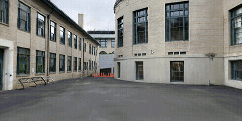
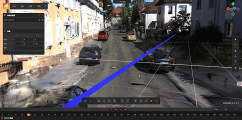
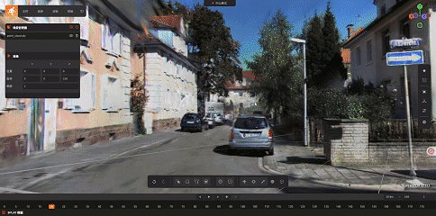
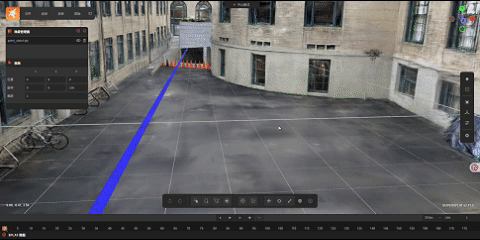
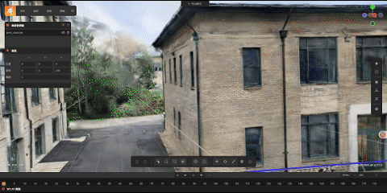
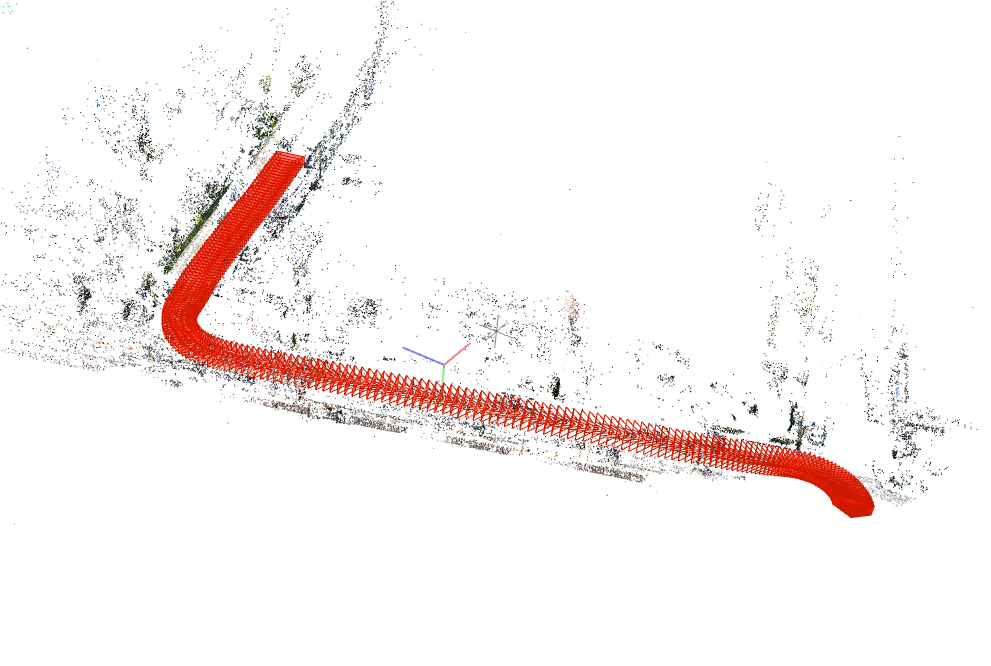
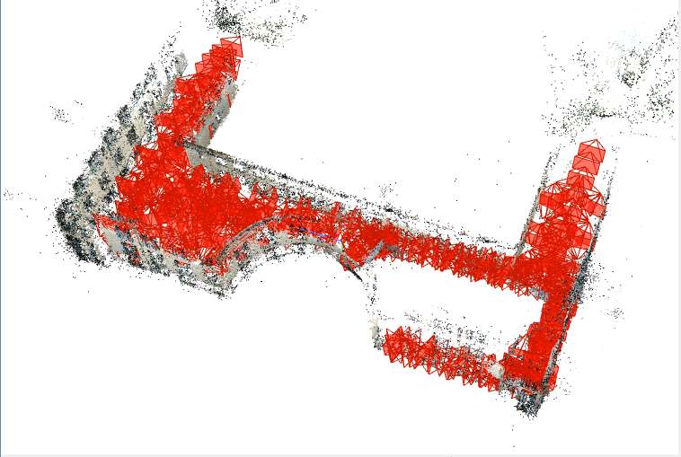
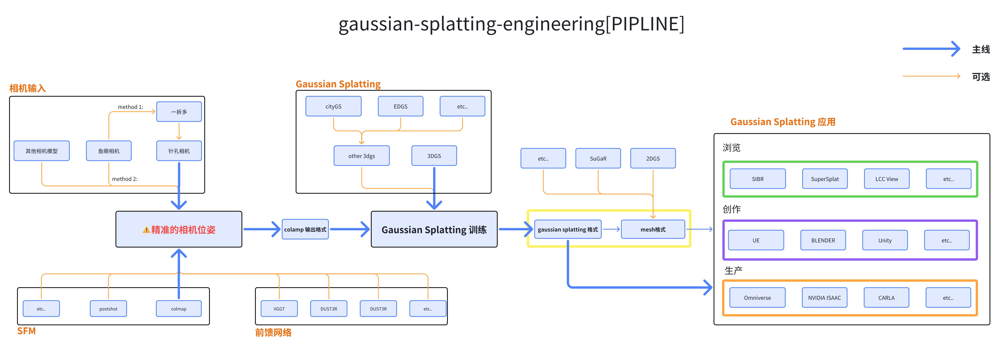

<h1 align="center">gaussian-splatting-engineering</h1>
<p align="center">
  <a href="https://evangeliona.github.io/"></a>
  <a href="https://space.bilibili.com/3546851796060172/upload/video"></a>
  
  <a href="./README.md"></a>
  <a href="docs/README_CN.md"></a>
</p>
<hr>

[English](../README.md) | 中文

# 介绍
  这个项目的目的是为了解决当前3DGS在学术探索与工程化部署的差距。当前大部分的论文都侧重于理论创新，而本项目则侧重于：

1. **工程化实现**
   
2. **稳定性能与效果优化**
   
3. **系统性的工作流程文档梳理**    

**该项目构建基于 [3DGS](https://github.com/graphdeco-inria/gaussian-splatting).**


## 📅 待办事项
- **优化项**
  - [x] [ABS-GS](https://github.com/TY424/AbsGS) *v0.0.1*
  - [ ] [RAIN-GS](https://github.com/whuhxb/RAIN-GS)
  - [ ] **......**
- **格式支持**
  - [ ] [USDZ format](https://github.com/nv-tlabs/3dgrut) / [Omniverse](https://docs.nvidia.com/omniverse/index.html#get-started)
  - [ ] [SPZ format](https://github.com/nianticlabs/spz)
  - [ ] [SOG format](https://github.com/fraunhoferhhi/Self-Organizing-Gaussians)
- **文档支持**
  - [ ] pipeline Instructions (WIP)
  - [ ] [colmap](https://github.com/TY424/AbsGS)
    - [ ] [USER GUID]
  - [ ] [RealityCapture](https://github.com/TY424/AbsGS)
    - [ ] [USER GUID]
  - [ ] [KIRI](https://github.com/TY424/AbsGS)
  - [ ] **......**
- **发布**
  - [x] v0.0.0 (3DGS-baseline)
  - [ ] v0.0.1 + GUI
  - [x] Google Drive
  - [x] Baidu Disk
  - [ ] reduce size
- **ADD UI**
  - [X] add base UI (待测试)

# Presentation
<div align="center">
<a> </a>
<a> </a>
<a> </a>
<a> </a>
<a> </a>
<a> </a>
<a> </a>
<a> </a>
</div>

# Result
数据集| 迭代次数 | 3DGS | ABS-GS | RAIN-GS
 ---- | ---- | ---- | ---- | ---- | 
 KITTI | 30000 | PSNR [28.50](./dataTestResult/3dgs-origin/kitti_07/log.txt)| PSNR [28.55](./dataTestResult/3dgs-abs/kitti_07/log.txt)| ...
 smith_hall_outdoor | 30000 | PSNR [24.85](./dataTestResult/3dgs-origin/smith_hall_outdoor/log.txt)| PSNR [24.64](./dataTestResult/3dgs-abs/smith_hall_outdoor/log.txt)| ...

## 说明
### 数据集说明
 数据集| 说明 | 分辨率 | 数量 | 
 ---- | ---- | ---- | ---- |
 KITTI |  自动驾驶数据集，因为其扫描方式为前向扫描(fordward-motion)，因此其深度图存在较大的误差，同样的缺乏多视角信息，其3dgs效果只在采集视角下表现较好。 | 1226x370 | 200 |
 smith_hall_outdoor_dataset-20240117T153219Z-001| CMU-Recon 系统利用高保真激光雷达扫描和 RGB 图像构建真实环境的3D重建。| 4032x3024 (1/8) | 450 |

### 测试版本说明
 发布版本| 说明 | 
 ---- | ---- 
 0.0.0 |  3DGS baseline
 0.0.1 |  ABS-GS

# 优化项说明
## 优化项
 论文 | 介绍 | 测试结果 |
 ---- | ---- | ----
 [ABS-GS](https://github.com/TY424/AbsGS) | 揭示3DGS中原有的自适应密度控制策略存在梯度冲突问题，该缺陷会导致性能下降，并提出以同向梯度作为致密化的指导。| [result](datatest/abs-gs/)
 [RAIN-GS](https://github.com/whuhxb/RAIN-GS) | 使用简单有效的策略包括稀疏大方差（SLV）随机初始化、渐进式高斯低通滤波器控制以及自适应边界扩展分割（ABE-Split）算法，即使从随机点云开始，也能稳健地引导3D高斯模型对场景进行建模。 | [result](datatest/rain-gs/)

## 格式支持
 格式 | 说明 | 
 ---- | ---- 
 [USDZ](https://github.com/nv-tlabs/3dgrut) | 通用场景描述（USD）是一个用于交换3D计算机图形数据的框架。该框架侧重于协作、无损编辑，以及支持对图形数据的多种视角。
 [SPZ](https://github.com/nianticlabs/spz) | SPZ编码的splats文件通常比相应的.ply文件小约10倍，两者之间的视觉差异极小。
 [SOG](https://github.com/fraunhoferhhi/Self-Organizing-Gaussians) | 将3DGS场景的参数组织到2D网格中,并在训练期间强制执行局部平滑度。然后利用现成的图像压缩来存储属性图像，以实现高压缩率。

## 项目结构
```text
📦 gaussian-splatting-engineering
├─ 📁 dataTestResult
│  ├─ 3dgs-origin/
│  ├─ abs-gs/
│  ├─ colmap/
│  ├─ improve-gs/
│  ├─ rain-gs/
├─ 📁 docs
│  └─ README_CN.md              
├─ 📁 gaussian-splatting-main
│  ├─ arguments/                    
│  ├─ assets/                   
│  ├─ gaussian_renderer/                     
│  ├─ IpipsPyTorch/                    
│  ├─ scene/
│  ├─ SIBR_viewers/
│  ├─ submodules/
│  ├─ utils/
│  ├─ .gitignore
│  ├─ .gitmodules
│  ├─ convert.py
│  ├─ environment.yml
│  ├─ full_eval.py
│  ├─ LICENSE.md
│  ├─ metrics.py
│  ├─ README.md
│  ├─ render.py
│  ├─ results.py
│  └─ train.py        
├─ LICENSE
└─ README.md                    
```


# Gaussian-Splatting 流程
<a> </a>

## Stage_0 : 数据采集
### 相机模型
 相机模型 | 说明 | 
 ---- | ---- 
 [针孔相机模型](https://en.wikipedia.org/wiki/Pinhole_camera_model) | 针孔摄像机模型描述了三维空间中一个点的坐标与其在理想针孔摄像机的图像平面上的投影之间的数学关系，在该图像平面上，相机孔径被描述为一个点，并且没有使用镜头来聚焦光线。
 [鱼眼相机模型](https://en.wikipedia.org/wiki/Fisheye_lens) | 鱼眼镜头是一种超广角镜头，它产生强烈的视觉扭曲，旨在创造一个广阔的全景或半球形图像。

### 采集方式
 采集方式 | 说明 | 
 ---- | ---- 
前向运动扫描 | 向前运动扫描是一种通过向前移动相机并从不同角度捕获图像来扫描对象或场景的方法，例如自动驾驶数据集KITTI。 
侧向运动扫描 | |侧运动扫描是一种通过向侧面移动相机并从不同角度捕获图像来扫描对象或场景的方法，常见的环绕式扫描。

## Stage_1 : 精准的相机位姿 [**关键**]
**⚠️没有精准的位姿就没有好的结果**

无论是3DGS项目还是传统的摄影测量技术，如SFM、MVS等，前期工作都涉及获取足够精确的相机位姿。这一步至关重要，因为这一步中的任何误差都会直接影响后续的重建结果。

**传统的相机位姿获取方法包括**:

开源 | 商业(免费) | 商业 | 移动端
 ---- | ---- | ---- | ----
 [COLMAP](https://github.com/colmap/colmap) <br> (recommended) | [postshot](https://www.jawset.com/) <br> (recommended)| [ContextCapture](https://www.contextcapture.com) | [KIRI](https://www.kiri.com)
 [openMVG](https://github.com/openMVG/openMVG) | [Reality Capture](https://www.realitycapture.com) | [大疆智图](https://enterprise.dji.com/cn/dji-terra)|[Polyscam](https://www.polyscanner.com)
 [OpenSfM](https://github.com/mapillary/OpenSfM) |  | |[matterport](https://www.matterport.com)
 [MVS](https://github.com/colmap/colmap) |  | |


**前馈网络**：
 论文 | 介绍 | 
 ---- | ---- 
 [VGGT](https://github.com/facebookresearch/vggt) | 视觉几何接地变换器（VGGT，CVPR 2025）是一种前馈神经网络，能在几秒钟内直接从场景的一个、几个或数百个视角推断出场景的所有关键3D属性，包括外部和内部相机参数、点图、深度图和3D点轨迹。
 [DUST3R](https://github.com/naver/dust3r) | 用于从任意图像集合中进行密集3D重建，无需事先进行相机校准或获取姿态信息。该方法将成对重建表述为点云的回归问题，从而统一了单目和双目情况。对于多图像输入，采用全局对齐策略将成对的点云对齐到一个共同的框架中。DUSt3R基于Transformer编码器/解码器构建，能够直接生成3D模型和深度图，同时恢复像素匹配和相机参数。实验表明，在单目/多视图深度估计和相对姿态估计任务中，DUSt3R均展现了最先进的性能。
 [MAST3R](https://github.com/naver/mast3r) | MASt3R(1)通过为甚至非常大的图像集合提供像素对应关系，将3D重建和定位任务的精度和细节提升到了一个新的水平。MASt3R的显著成果是通过在DUSt3R框架(2)的基础上增加一个额外的头部和一个匹配算法来实现的，这样它就能高效地输出一个具有度量尺度的3D重建结果，同时输出密集的局部特征图，从而提供准确的深度感知和空间理解。
 [FAST3R](https://github.com/facebookresearch/fast3r) | 在本研究中，我们提出了Fast 3D Reconstruction（Fast3R），这是对DUSt3R的一种新颖的多视图泛化方法，通过并行处理多个视图来实现高效且可扩展的3D重建。Fast3R基于Transformer的架构在单次前向传递中转发N张图像，无需进行迭代对齐。
 etc. |  **......**
  


## Stage_2 : Gaussian Splatting 训练

**软件(持续更新)**
 商业免费 | 移动端 | 
 ---- | ---- 
[postshot](https://www.jawset.com/) <br> (recommended) | [KIRI Engine](https://www.kiriengine.app/)
[DJI TERRA](https://enterprise.dji.com/cn/dji-terra) | [Polycam](https://poly.cam/)
[Volinga](https://web.volinga.ai/#VolingaSuite) | 
[Luma AI](https://lumalabs.ai/learning-hub) |


### 开始

### 安装

参考 [gaussian-splatting](https://github.com/graphdeco-inria/gaussian-splatting#setup)

## Stage_3 : 3DGS应用

### **可视化**

 项目 | 介绍 | 使用说明 |
 ---- | ---- | ----
 [SIBR](https://sibr.gitlabpages.inria.fr/) | 官方3DGS可视化工具 | [gaussian-splatting-SIBR](https://github.com/graphdeco-inria/gaussian-splatting?tab=readme-ov-file#interactive-viewers)
 [SuperSplat](https://github.com/playcanvas/supersplat) <br> (**recommended**)| SuperSplat是一款免费且开源的工具，用于检查、编辑、优化和发布3D高斯斑点。它基于网络技术构建，可在浏览器中运行，因此无需下载或安装。 | [live version](https://superspl.at/editor)
 [LCC Viewer](https://xgrids.cn/support/download?page=LCCViewer) | 其余创新的一款轻量级的LCC模型查看器，配备测量工具和注释功能，专为项目审查和协作而优化。 | [website](https://xgrids.com/support/download?page=LCCViewer)
 
### **创作领域**
 软件 | 项目 | 简介 |
 ---- | ---- | ----
 [UE](https://sibr.gitlabpages.inria.fr/) + 3DGSPlugin | [XScene-UEPlugin](https://github.com/xverse-engine/XScene-UEPlugin/tree/main) | 对高斯飞溅模型提供了实时可视化、管理、编辑以及可扩展的混合渲染功能，这是一种从多视图照片重建3D场景的新技术。
[UE](https://sibr.gitlabpages.inria.fr/) + 3DGSPlugin | [3DGS-UE-SDK](https://github.com/SenseSpace-AI3D/3DGS-UE-SDK) | [商汤琼宇SenseSpace平台 3D Gaussian Splatting Unreal plugin](https://space.sensetime.com/home) **需要申请试用**
|||
 [Blender](https://github.com/playcanvas/supersplat) + 3DGSPlugin | [KIRI_BlenderPlugin](https://github.com/Kiri-Innovation/3dgs-render-blender-addon) <br> | 1.在熟悉的环境中使用3DGS内容。<br>2.在3DGS转换之前编辑和优化点云。<br>3.创建动画和动态图形。<br>4.物体对光线做出反应并投射阴影。|
 [Blender](https://github.com/playcanvas/supersplat) + 3DGS +4DG ViewerNode |[mediastormDev-BlenderNode](https://github.com/mediastormDev/Blender-3DGS-4DGS-Viewer-Node) | 影视飓风在4DGS云冈石窟项目中开发的一个自定义Blender节点。该节点支持加载和预览3DGS和4DGS数据集，并提供基本渲染样式以供快速检查。
 [Houdini](https://www.sidefx.com/) + GSOPs | [GSOPs](https://github.com/cgnomads/GSOPs) | GSOPs包含一个实时视口渲染器、示例文件以及一套数字资源，用于高效导入、编辑和导出2D和3D高斯飞溅内容。
 etc. |  **......**
 


### **工程领域**
 项目 | 简介 | 使用说明 |
 ---- | ---- | ----
 [Omniverse](https://docs.nvidia.com/omniverse/index.html#get-started) | NVIDIA Omniverse是一个包含API、服务和软件开发工具包（SDK）的平台，它使开发人员能够为工业数字化构建支持生成式人工智能的工具、应用程序和服务。 | [SDK](https://docs.nvidia.com/omniverse/index.html#get-started)
 [NVIDIA Isaac](https://developer.nvidia.com/isaac) | 准备好开始开发您的AI机器人了吗？NVIDIA Isaac™平台提供了您所需的NVIDIA CUDA加速库、应用框架和AI模型，助您打造自主移动机器人（AMR）、机械臂和机械手、人形机器人等。 | [github](https://github.com/nvidia-isaac) |
 [OpenUSD](https://developer.nvidia.com/usd?sortBy=developer_learning_library%2Fsort%2Ffeatured_in.usd_resources%3Adesc%2Ctitle%3Aasc&hitsPerPage=6) |  OpenUSD由皮克斯动画工作室开发，是一个用于创建、模拟3D世界并进行协作的开源框架。OpenUSD是NVIDIA Omniverse™的基础，NVIDIA Omniverse™是一个用于开发工业数字化和生成式物理人工智能3D应用的平台。 | [DOC](https://developer.nvidia.com/usd?sortBy=developer_learning_library%2Fsort%2Ffeatured_in.usd_resources%3Adesc%2Ctitle%3Aasc&hitsPerPage=6#section-getting-started)
  etc. |  **......**

## 🎉 致谢

本项目基于[3DGS](https://github.com/graphdeco-inria/gaussian-splatting)构建。我们感谢所有作者提供的优秀资源。

## 📚 贡献

非常感谢您为开源社区的3DGS项目所做的贡献！

<section class="section" id="BibTeX">
  <div class="container is-max-desktop content">
    <h3 class="title">BibTeX</h3>
    <pre><code>@Article{kerbl3Dgaussians,
      author       = {Kerbl, Bernhard and Kopanas, Georgios and Leimk{\"u}hler, Thomas and Drettakis, George},
      title        = {3D Gaussian Splatting for Real-Time Radiance Field Rendering},
      journal      = {ACM Transactions on Graphics},
      number       = {4},
      volume       = {42},
      month        = {July},
      year         = {2023},
      url          = {https://repo-sam.inria.fr/fungraph/3d-gaussian-splatting/}
}</code></pre>
  </div>
</section>

## 许可

本项目采用MIT许可证授权 - 详情请参阅[LICENSE.md](LICENSE)文件。